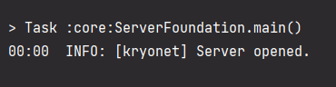
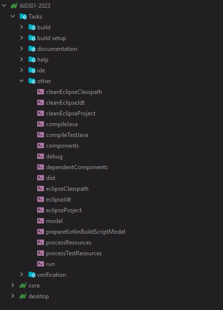
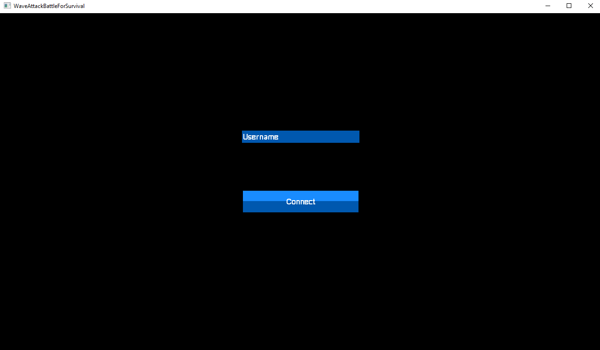
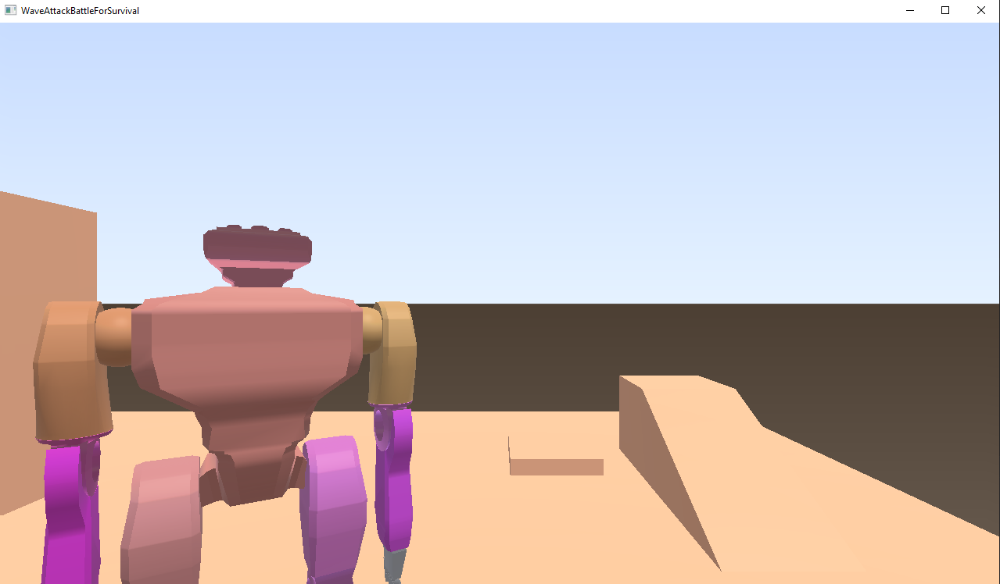

## How to start the game?

1. Download or clone the repository to your computer.
2. Open the repository in your IDE.
3. **Starting the server:**
   iti0301-2023/core/src/com.wabs/server/ServerFoundation (click on the green arrow in the main() method)

4. There should be an inscription in the console stating that the server is open

5. Run the run file in gradle iti0301-2023/Tasks/other/run
(You can run a maximum of three times for now)

6. After starting, you get a connect screen, enter username there and click connect 

7. The main game screen appears. At the moment, for some reason, the cursor is not captured,
so you need to press "ESC" twice so that the cursor is captured, and you can turn the camera.

**Control:**

P - start the game
W - move forward
S - move back
A - move left
D - move right

ESCAPE - close the game

**Current bugs:**
1. The player moves crookedly and does not take into account the position of the camera, most often this happens with 
the first launched player.
2. The camera is not working well

## Connection
1. The server starts, on TCP ports - 8080, UDP - 8080.
2. The client connects to localhost via TCP - 8080, UDP - 8080 ports.
3. The client requests a TCP connection from the server (the player's String username is sent).
4. If the server approves the request, the server assigns a username and id to this player and sends a response TCP (with Integer id and String username) about successful connection to this client, and immediately sends all other players a TCP packet that a new player has been added.
5. Each player continuously sends TCP packets about his position and direction (Vector3, Matrix4, Integer id) to the server.
6. Further on the server, this information about the player is updated, sent to all players via UDP, and each player updates the location of other players on his client.
7. When a player disconnects, a TCP is sent to the server. A TCP is sent from the server to all players that this player needs to be removed.
